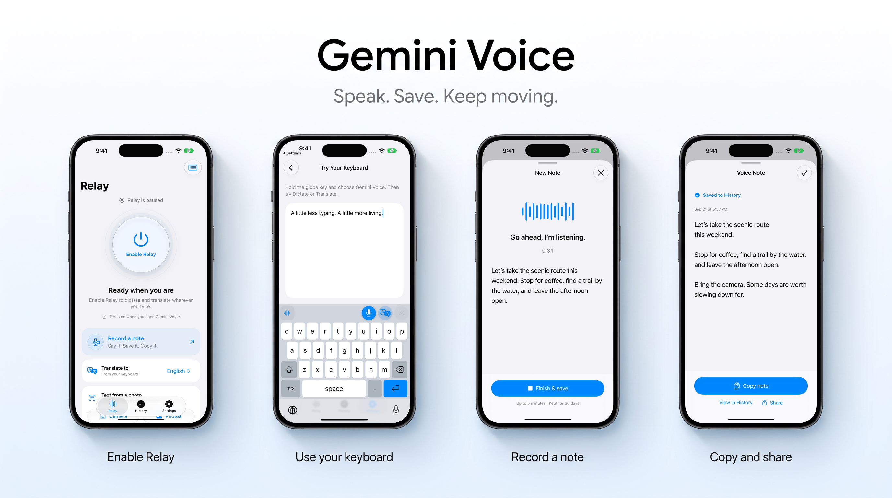
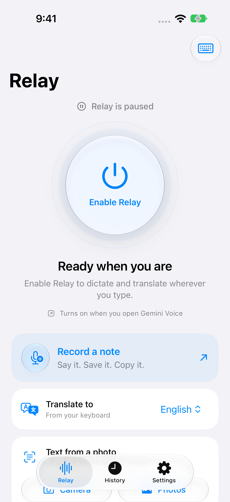
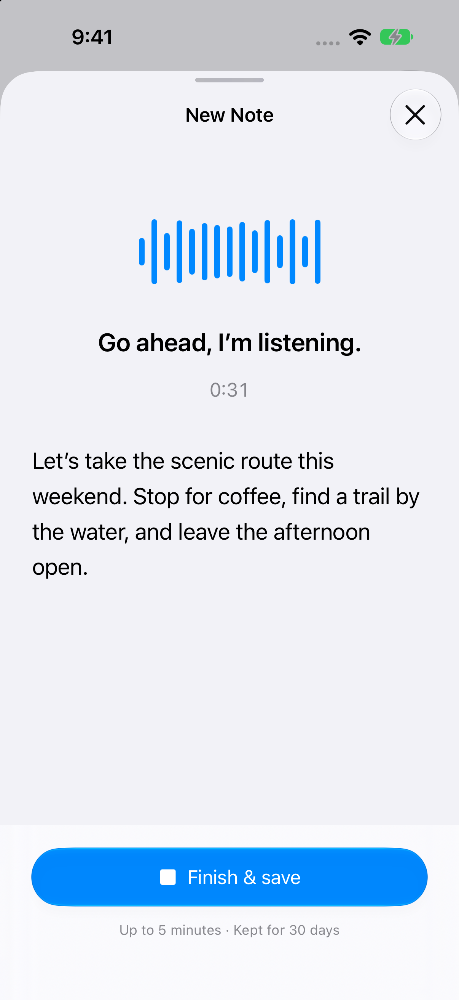
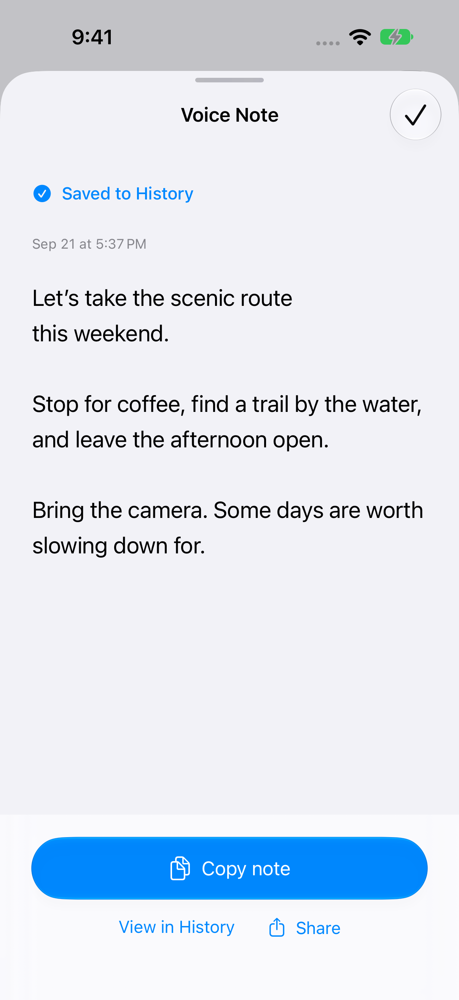

# Gemini Voice for iOS



**Less typing. More room for a thought.**

Dictate wherever you type, translate as you speak, or record a note right inside the app. Gemini Voice pairs a native iOS 27 interface with Gemini Live transcription, a custom keyboard, and a history you can copy from anytime.

[**Download the source**](https://github.com/aliceisjustplaying/GeminiKeyboardSample/archive/refs/heads/main.zip) · [**Run on your iPhone**](#run-the-sample) · [**Explore the architecture**](docs/ARCHITECTURE.md)

## Three ways to capture your words

- **Use your keyboard.** Enable Relay, open any ordinary text field, and tap Dictate or Translate. Finish to insert the result.
- **Record a note.** Tap Record a note in the app. Watch your words appear, finish, then copy or share the saved text.
- **Read a photo.** Capture a page, sign, or receipt and turn its text into something you can use.

History keeps completed text **forever by default**. Choose an automatic deletion period under **Settings → Keep history**, or delete individual entries whenever you like. Audio waiting for a retry stays separate from text retention.

<p align="center">
  
  &nbsp;
  
  &nbsp;
  
</p>

*Real iOS Simulator captures with sample text. The banner frames these screens using Nano Banana.*

> [!IMPORTANT]
> This is a personal developer sample, not a production SDK or an App Store-ready app. Its Debug-only cold handoff uses private iOS behavior for a smoother personal-device demo. Release compiles that behavior out.

## What it demonstrates

- `gemini-3.5-transcribe-live` streaming microphone audio and returning live text.
- `gemini-3.5-live-translate-preview` translating speech while it is spoken.
- A custom keyboard controlling microphone capture in its containing app through an App Group. Keyboard extensions cannot access the microphone themselves.
- Safe Finish, Cancel, fallback, recovery, and insertion into the original text field.
- KeyboardKit 10.9.4 handles the typing surface and gestures, with Gemini voice controls above it. A small local emoji picker is included; no Pro license is configured.
- In-app voice notes that save directly to History without queuing a keyboard insertion.
- Native glass controls, system light/dark appearance, accessible text sizes and configurable history retention.

## Custom vocabulary (this fork)

Open **Settings → Custom vocabulary** in the Gemini Voice app. Add one word or phrase per line, then tap **Save**. Edit or remove lines to change the list; save an empty list to clear it. **Cancel** discards edits.

Your list stays saved on this phone. The app sends it to Google to help recognize your words when you dictate. Changes apply to the next recording. If the app automatically retries a failed dictation, it keeps the list that recording started with. Retrying from Saved recordings uses your latest saved list. The live Translate feature does not use these hints. Hints guide recognition; they do not force exact replacements.

Blank lines and exact duplicates are ignored. The editor supports up to 1,000 unique terms and blocks saving above that limit. Google recommends a focused list of up to 100 terms for best results. See Google's [Live vocabulary documentation](https://ai.google.dev/gemini-api/docs/live-api/live-transcribe#custom-vocabulary-biasing) and [batch vocabulary documentation](https://ai.google.dev/gemini-api/docs/transcribe#custom-vocabulary).

## Model routing

The keyboard voice buttons always start a Gemini Live session. There is no batch-mode toggle.

| Action | Primary model | Fallback |
| --- | --- | --- |
| **Dictate / Record a note** | `gemini-3.5-transcribe-live` | `gemini-3.5-transcribe` after a Live failure |
| **Translate** | `gemini-3.5-live-translate-preview` | `gemini-3.5-transcribe` + `gemini-3.5-flash` after a Live failure |
| **Camera OCR** | `gemini-3.8-flash` | None |

The Flash models are never used for a normal keyboard voice request. They are limited to OCR and the emergency text-only translation step after Live has failed.

Model IDs and preview APIs change. Verify them against Google's [Live transcription](https://ai.google.dev/gemini-api/docs/live-api/live-transcribe), [Live translation](https://ai.google.dev/gemini-api/docs/live-api/live-translate), and [Gemini 3.8 Flash](https://ai.google.dev/gemini-api/docs/models/gemini-3.8-flash) documentation before adopting the sample.

## How it works

```text
Custom keyboard
  │  start / finish / cancel + request ID
  ▼
Locked App Group store
  │
  ▼
Containing app microphone relay
  ├─ PCM stream → Gemini Live
  └─ protected WAV → fallback/retry only
  │
  ▼
Matching App Group result
  │
  ▼
UITextDocumentProxy.insertText
```

The important code is intentionally easy to find:

| Area | Location |
| --- | --- |
| Live model setup, streaming, events, and finalization | [`App/Gemini/Live`](App/Gemini/Live) |
| Batch fallback and OCR requests | [`App/Gemini/Batch`](App/Gemini/Batch) |
| Microphone capture and PCM conversion | [`App/Audio`](App/Audio) |
| App-side keyboard relay | [`App/Relay`](App/Relay) |
| Keyboard controller and UI | [`KeyboardExtension`](KeyboardExtension) |
| Cross-process request/result protocol | [`Shared/Relay`](Shared/Relay) |

For the detailed state machine and safety invariants, see [`docs/ARCHITECTURE.md`](docs/ARCHITECTURE.md). For a file-by-file Gemini guide, see [`App/Gemini/README.md`](App/Gemini/README.md).

## Requirements

- Xcode 27 or later
- iOS 27 or later
- A physical iPhone
- An Apple Developer team with three bundle identifiers and one shared App Group
- A Gemini API key for personal development
- [XcodeGen](https://github.com/yonaskolb/XcodeGen)

## Run the sample

1. Create the local configuration:

   ```sh
   cp Config/Secrets.xcconfig.example Config/Secrets.xcconfig
   ```

2. Add your Apple team, unique bundle identifiers, App Group, and Gemini API key to `Config/Secrets.xcconfig`.

3. Register the same identifiers and App Group in your Apple Developer account, then generate the project:

   ```sh
   xcodegen generate
   ```

4. Run the simulator test suite:

   ```sh
   ./Scripts/test.sh
   ```

   To test the keyboard UI independently on an iPhone simulator running iOS 18.5 or later:

   ```sh
   ./Scripts/test-keyboard.sh <simulator-UDID>
   ```

   This host tests key taps, the lowercase toggle, emoji insertion and recording-view transitions without recording audio or contacting Gemini. It does not test the app-to-extension recording handoff.

5. Deploy to a paired iPhone:


   ```sh
   xcrun devicectl list devices
   ./Scripts/deploy-device.sh <device-identifier>
   ```

6. On the iPhone, add **Gemini Voice** under **Settings → General → Keyboard → Keyboards**, enable **Allow Full Access**, open the containing app once, and grant microphone access.

7. In any normal text field, select the keyboard and try **Dictate** or **Translate**. Tap the active button again to Finish; use **X** to discard.

You can also skip keyboard setup and tap **Record a note** in the app. Tap **Finish & save**, then **Copy note**. Find it again in **History**. Notes automatically finish after five minutes.

The download is an Xcode source project, not a pre-signed iPhone app. Supply your own signing configuration and Gemini key before deploying.

## App navigation

- **Relay** has the power control, idle countdown, Record a note, translation language, and photo text tools. Enabling Relay prepares the keyboard; it does not start recording.
- **History** keeps completed text available to copy or share for your chosen retention period, with no item-count limit. Swipe to delete one entry. Failed audio stays available to retry or delete.
- **Settings** contains history retention (Keep forever initially), the Gemini connection, keyboard setup, a practice text field, model details, and audio privacy information.

The app follows system light/dark appearance and Dynamic Type. Glass is used for navigation and controls; content uses system backgrounds. Simulator visual fixtures are opt-in through `GEMINI_VOICE_VISUAL_TEST_SCENARIO` (`history`, `recording`, `handoff`, `note-recording`, or `note-saved`), use in-memory data, and do not run in Release or on physical devices.

## Behavior worth knowing

- **Warm relay is the intended path.** The containing app keeps its microphone session armed briefly in the background, so the keyboard can start immediately without leaving the text field.
- **Cold relay needs a handoff.** Release asks the user to return manually. The personal Debug build contains an unsupported automatic-return experiment.
- **Finish is not Cancel.** Finish drains accepted audio and waits for the authoritative final result. Cancel remains available while recording or processing; it stops the work, deletes the temporary recording, and inserts nothing.
- **Long recordings auto-finish at five minutes.** This bounds background and fallback resource use without interrupting normal dictation-length speech.
- **Fallback is explicit.** A complete local WAV is used only when Live fails after Finish. Failed recordings remain available for a user-initiated retry.
- **Insertion is guarded.** A result is inserted automatically only when its request and document anchor still match; otherwise the keyboard offers **Insert latest**.

## Security boundary

`Config/Secrets.xcconfig` is ignored by Git, but a Debug key compiled into an app is still extractable. Use a restricted development key with billing limits.

Production software should keep long-lived keys on a backend, proxy batch requests, and issue constrained [ephemeral tokens](https://ai.google.dev/gemini-api/docs/live-api/ephemeral-tokens) for direct Live connections. Review the included privacy manifests and make your own privacy disclosures.

## License

Licensed under the [Apache License 2.0](LICENSE). KeyboardKit and LicenseKit are separate binary dependencies with their own licenses, documented in [`THIRD_PARTY_NOTICES.md`](THIRD_PARTY_NOTICES.md).
